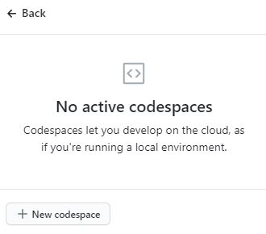
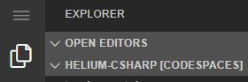

# Managed Identity and Key Vault with App Services

> Build a Web API reference application using Managed Identity, Key Vault, and Cosmos DB that is designed to be deployed to Azure App Service or Azure Kubernetes Service (AKS)


This is a Web API reference application designed to "fork and code" with the following features:

- Securely build, deploy and run an Azure App Service (Web App for Containers) application
- Securely build, deploy and run an Azure Kubernetes Service (AKS) application
- Use Managed Identity to securely access resources
- Securely store secrets in Key Vault
- Securely build and deploy the Docker container from Azure Container Registry (ACR) or Azure DevOps
- Connect to and query Cosmos DB
- Automatically send telemetry and logs to Azure Monitor
- Deliver observability best practices via dashboards, alerting and availability tests


## Prerequisites

- Azure subscription with permissions to create:
  - Resource Groups, Service Principals, Key Vault, Cosmos DB, Azure Container Registry, Azure Monitor, App Service or AKS
- Bash shell (tested on Visual Studio Codespaces, Mac, Ubuntu, Windows with WSL2)
  - Will not work in Cloud Shell or WSL1
- Azure CLI ([download](https://docs.microsoft.com/en-us/cli/azure/install-azure-cli?view=azure-cli-latest))
- Docker CLI ([download](https://docs.docker.com/install/))
- Visual Studio Code (optional) ([download](https://code.visualstudio.com/download))

## Setup

> [Visual Studio Codespaces](https://visualstudio.microsoft.com/services/visual-studio-codespaces/) is the easiest way to evaluate helium as all of the prerequisites are automatically installed

### Codespaces

Setup using Visual Studio Codespaces

- Open your [Codespaces](https://online.visualstudio.com/environments)
- Sign in if prompted
- If you haven't used Codespaces, you will be prompted to create a new Codespace
- Click on Create Codespace


- If you haven't setup a billing plan, you will be prompted to set one up
  - Expand the Advanced Options or accept the defaults



- Create your Codespace
  - Name your Codespace
  - Choose which Helium language implementation you want to use and create a new Codespaces from the repo
    - retaildevcrews/helium-csharp
    - retaildevcrews/helium-java
    - retaildevcrews/helium-typescript
  - Choose your Linux instance type
  - Click Create


> dotfiles allow you to customize your Codespace to your individual preferences
>
> Using dotfiles is optional
>
> A sample dotfiles repo is available [here](https://github.com/retaildevcrews/dotfiles)

- Codespaces will display a `Creation Log` window
  - You may close this window once all the steps have completed

> Codespaces is now ready to use!

- Open a terminal in Codespaces
  - use the command palette or press ctl + `
  - you can also click on the Menu button in the upper left corner
    - choose view
    - choose terminal



> If using Codespaces, skip to the Azure login step

### bash

Choose which Helium language implementation you want to use and clone the repo

```bash

### skip this step if using Codespaces

# run one of these commands

# dotnet (C#)
git clone https://github.com/retaildevcrews/helium-csharp helium

# Java (Spring-Boot)
git clone https://github.com/retaildevcrews/helium-java helium

# TypeScript (Restify)
git clone https://github.com/retaildevcrews/helium-typescript helium

cd helium

```

#### Login to Azure and select subscription

```bash

az login

# show your Azure accounts
az account list -o table

# select the Azure subscription if necessary
az account set -s {subscription name or Id}

```

#### Choose a unique DNS name

```bash

# this will be the prefix for all resources
# only use a-z and 0-9 - do not include punctuation or uppercase characters
# must be at least 5 characters long
# must start with a-z (only lowercase)
export He_Name=[your unique name]

### if true, change He_Name
az cosmosdb check-name-exists -n ${He_Name}

### if nslookup doesn't fail to resolve, change He_Name
nslookup ${He_Name}.azurewebsites.net
nslookup ${He_Name}.vault.azure.net
nslookup ${He_Name}.azurecr.io

```

#### Create Resource Groups

> When experimenting with `helium`, you should create new resource groups to avoid accidentally deleting resources
>
> If you use an existing resource group, please make sure to apply resource locks to avoid accidentally deleting resources

- You will create 3 resource groups
  - One for ACR
  - One for App Service or AKS, Key Vault and Azure Monitor
  - One for Cosmos DB

```bash

# set location
export He_Location=centralus

# set the subscription
export He_Sub='az account show -o tsv --query id'

# set resource group names
export Imdb_Name=$He_Name
export He_ACR_RG=${He_Name}-rg-acr
export He_App_RG=${He_Name}-rg-app
export He_WebV_RG=${He_Name}-rg-webv
export Imdb_RG=${Imdb_Name}-rg-cosmos

# export Cosmos DB env vars
# these will be explained in the Cosmos DB setup step
export Imdb_Location=$He_Location
export Imdb_DB=imdb
export Imdb_Col=movies
export Imdb_RW_Key='az cosmosdb keys list -n $Imdb_Name -g $Imdb_RG --query primaryMasterKey -o tsv'

# create the resource groups
az group create -n $He_App_RG -l $He_Location
az group create -n $He_ACR_RG -l $He_Location
az group create -n $He_WebV_RG -l $He_Location
az group create -n $Imdb_RG -l $Imdb_Location

# run the saveenv.sh script at any time to save He_*, Imdb_*, MI_*, and AKS_* variables to ~/.helium.env
# the saveenv.sh script sets He_Repo correctly based on the helium language version you are using
./saveenv.sh

# if your terminal environment gets cleared, you can source the file to reload the environment variables
source ~/.helium.env

```

#### Create Azure Key Vault

- All secrets are stored in Azure Key Vault for security
  - Helium uses Managed Identity to access Key Vault in production
    - Helium uses Azure CLI credentials in development

```bash

## create the Key Vault
az keyvault create -g $He_App_RG -n $He_Name

```

Key Vault does a soft delete when deleting vaults. If you have gone through this setup already, you could run into errors like "Exist soft deleted vault with the same name.", and "Secret is currently in a deleted but recoverable state ...". You can check if you have deleted vaults and keys with the commands below.

```shell

# list deleted keyvaults that still exist
az keyvault list-deleted -o table

# list deleted secrets that still exist
az keyvault secret list-deleted --vault-name $He_Name -o table

```

If you see the Helium vaults or secrets in this state, you can purge or recover the values before moving forward.

#### Create and load sample data into Cosmos DB

- This takes several minutes to run
- This reference app is designed to use a simple dataset from IMDb of 1300 movies and their associated actors and genres
- Follow the steps in the [IMDb Repo](https://github.com/retaildevcrews/imdb) to create a Cosmos DB server, database, and collection and load the sample IMDb data
  - The repo readme also provides an explanation of the data model design decisions

  > You can safely start with the Create Cosmos DB step
  >
  > The initial steps were completed above

Save the Cosmos DB config to Key Vault

```bash

# add Cosmos DB config to Key Vault
az keyvault secret set -o table --vault-name $He_Name --name "CosmosUrl" --value https://${Imdb_Name}.documents.azure.com:443/
az keyvault secret set -o table --vault-name $He_Name --name "CosmosKey" --value $(az cosmosdb keys list -n $Imdb_Name -g $Imdb_RG --query primaryReadonlyMasterKey -o tsv)
az keyvault secret set -o table --vault-name $He_Name --name "CosmosDatabase" --value $Imdb_DB
az keyvault secret set -o table --vault-name $He_Name --name "CosmosCollection" --value $Imdb_Col

# retrieve the Cosmos DB key using eval $Imdb_RO_Key
export Imdb_RO_Key='az keyvault secret show -o tsv --query value --vault-name $He_Name --name CosmosKey'

# save the Imdb variables
./saveenv.sh -y

```

#### Create Azure Monitor

> The Application Insights extension is in preview and needs to be added to the CLI

```bash

# Add App Insights extension
az extension add -n application-insights
az feature register --name AIWorkspacePreview --namespace microsoft.insights
az provider register -n microsoft.insights

# Create App Insights
az monitor app-insights component create -g $He_App_RG -l $He_Location -a $He_Name -o table

# add App Insights Key to Key Vault
az keyvault secret set -o tsv --query name --vault-name $He_Name --name "AppInsightsKey" --value $(az monitor app-insights component show -g $He_App_RG -a $He_Name --query instrumentationKey -o tsv)

# save the env variable - use eval $He_AppInsights_Key
export He_AppInsights_Key='az keyvault secret show -o tsv --query value --vault-name $He_Name --name AppInsightsKey'

# save the environment variables
./saveenv.sh -y

```

#### Run helium locally

- You can now follow the language specific readme to run helium locally
  - this step is optional

#### Setup Azure Container Registry

- Create the Container Registry with admin access `disabled`

```bash

# create the ACR
az acr create --sku Standard --admin-enabled false -g $He_ACR_RG -n $He_Name

# Login to ACR
az acr login -n $He_Name

# if you get an error that the login server isn't available, it's a DNS issue that will resolve in a minute or two, just retry

# import the helium image
az acr import -n $He_Name --source docker.io/retaildevcrew/$He_Repo:stable --image $He_Repo:latest

```

#### Create a Service Principal for Container Registry

> Currently, App Service cannot access ACR via Managed Identity, so we have to create a Service Principal and grant access to that SP

```bash

# get the Container Registry Id
export He_ACR_Id=$(az acr show -n $He_Name -g $He_ACR_RG --query "id" -o tsv)

# create a Service Principal scoped to the ACR with the acrpull role and add password to Key Vault
az keyvault secret set -o table --vault-name $He_Name --name "AcrPassword" --value $(az ad sp create-for-rbac -n http://${He_Name}-acr-sp --scope $He_ACR_Id --role acrpull --query password -o tsv)

# add Service Principal ID to Key Vault
az keyvault secret set -o table --vault-name $He_Name --name "AcrUserId" --value $(az ad sp show --id http://${He_Name}-acr-sp --query appId -o tsv)

# retrieve the values using eval $He_SP_*
export He_SP_PWD='az keyvault secret show -o tsv --query value --vault-name $He_Name --name AcrPassword'
export He_SP_ID='az keyvault secret show -o tsv --query value --vault-name $He_Name --name AcrUserId'

# get the URLs for the secrets
export He_AcrUserId=$(az keyvault secret show --vault-name $He_Name --name "AcrUserId" --query id -o tsv)
export He_AcrPassword=$(az keyvault secret show --vault-name $He_Name --name "AcrPassword" --query id -o tsv)

# save the environment variables
./saveenv.sh -y

```

## Deploy the container to App Service or AKS

- Instructions for [App Service](docs/AppService.md)
- Instructions for [AKS](docs/aks/README.md#L233)

## Team Development

In order to run helium locally, each developer will need access to the Key Vault. Since you created the Key Vault during setup, you will automatically have permission, so this step is only required for additional developers.

Use the following command to grant permissions to each developer that will need access.

```bash

# grant Key Vault access to each developer
az keyvault set-policy -n $He_Name --secret-permissions get list --key-permissions get list --object-id \
$(az ad user show --query objectId -o tsv --id {developer email address})

```

## Contributing

This project welcomes contributions and suggestions. Most contributions require you to agree to a
Contributor License Agreement (CLA) declaring that you have the right to, and actually do, grant us
the rights to use your contribution. For details, visit [Microsoft Contributor License Agreement](https://cla.opensource.microsoft.com).

When you submit a pull request, a CLA bot will automatically determine whether you need to provide
a CLA and decorate the PR appropriately (e.g., status check, comment). Simply follow the instructions
provided by the bot. You will only need to do this once across all repos using our CLA.

This project has adopted the [Microsoft Open Source Code of Conduct](https://opensource.microsoft.com/codeofconduct/).

For more information see the [Code of Conduct FAQ](https://opensource.microsoft.com/codeofconduct/faq/) or
contact [opencode@microsoft.com](mailto:opencode@microsoft.com) with any additional questions or comments
