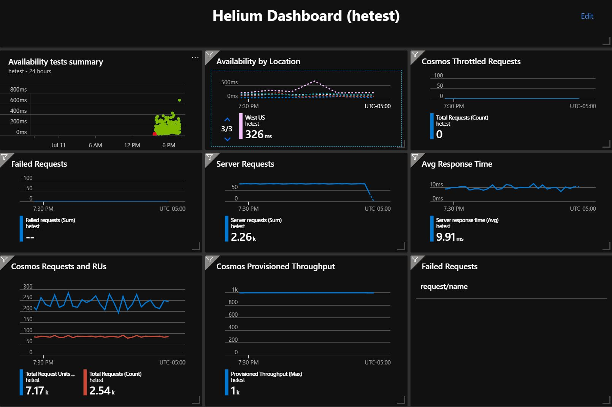

# Deploy Helium to Azure App Service

Create and configure App Service (Web App for Containers)

```bash

# create App Service plan
az appservice plan create --sku S1 --is-linux -g $He_App_RG -n ${He_Name}-plan

# create Web App for Containers
# temporarily use the nginx image
az webapp create --deployment-container-image-name nginx -g $He_App_RG -p ${He_Name}-plan -n $He_Name

# stop the Web App
az webapp stop -g $He_App_RG -n $He_Name

# assign Managed Identity
export He_MI_ID=$(az webapp identity assign -g $He_App_RG -n $He_Name --query principalId -o tsv)

# grant Key Vault access to Managed Identity
az keyvault set-policy -n $He_Name --secret-permissions get list --key-permissions get list --object-id $He_MI_ID

# turn on CI
export He_CICD_URL=$(az webapp deployment container config -n $He_Name -g $He_App_RG --enable-cd true --query CI_CD_URL -o tsv)

# add the webhook
az acr webhook create -r $He_Name -n ${He_Name} --actions push --uri $He_CICD_URL --scope ${He_Repo}:latest

# set the Key Vault config setting
az webapp config appsettings set --settings KEYVAULT_NAME=$He_Name -g $He_App_RG -n $He_Name

# turn on container logging
# this will send stdout and stderr to the logs
az webapp log config --docker-container-logging filesystem -g $He_App_RG -n $He_Name

# save environment variables
./saveenv.sh -y

### App Service cannot currently use Managed Identity to access ACR
### We pull the previously created Service Principal ID and Key from Key Vault via
### the @Microsoft.KeyVault() format used in -u and -p below

# configure the Web App to use Container Registry
az webapp config container set -n $He_Name -g $He_App_RG \
-i ${He_Name}.azurecr.io/${He_Repo} \
-r https://${He_Name}.azurecr.io \
-u "@Microsoft.KeyVault(SecretUri=${He_AcrUserId})" \
-p "@Microsoft.KeyVault(SecretUri=${He_AcrPassword})"

# start the Web App
az webapp start -g $He_App_RG -n $He_Name

# check the version endpoint
# you may get a 403 or timeout error, if so, just retry

http https://${He_Name}.azurewebsites.net/version

```

Run the Validation Test

> For more information on the validation test tool, see [Web Validate](https://github.com/retaildevcrews/webvalidate)

```bash

# run the tests in the container
docker run -it --rm retaildevcrew/webvalidate --server https://${He_Name}.azurewebsites.net --files helium.json

```

## Smoke Test setup

Deploy [Web Validate](https://github.com/retaildevcrews/webvalidate) to drive consistent traffic to the App Service for monitoring and alerting.

```bash

# Add Log Analytics extension
az extension add -n log-analytics

# create Log Analytics for the webv clients
az monitor log-analytics workspace create -g $He_WebV_RG -l $He_Location -n $He_Name -o table

# retrieve the Log Analytics values using eval $He_LogAnalytics_*
export He_LogAnalytics_Id='az monitor log-analytics workspace show -g $He_WebV_RG -n $He_Name --query customerId -o tsv'
export He_LogAnalytics_Key='az monitor log-analytics workspace get-shared-keys -g $He_WebV_RG -n $He_Name --query primarySharedKey -o tsv'

# save the environment variables
./saveenv.sh -y

# create Azure Container Instance running webv
az container create -g $He_WebV_RG --image retaildevcrew/webvalidate:debug -o tsv --query name \
-n ${He_Name}-webv-${He_Location} -l $He_Location \
--log-analytics-workspace $(eval $He_LogAnalytics_Id) --log-analytics-workspace-key $(eval $He_LogAnalytics_Key) \
--command-line "dotnet ../webvalidate.dll --tag $He_Location -l 1000 -s https://${He_Name}.azurewebsites.net -u https://raw.githubusercontent.com/retaildevcrews/${He_Repo}/master/TestFiles/ -f benchmark.json -r --json-log"

# create in additional regions (optional)
az container create -g $He_WebV_RG --image retaildevcrew/webvalidate:debug -o tsv --query name \
-n ${He_Name}-webv-eastus2 -l eastus2 \
--log-analytics-workspace $(eval $He_LogAnalytics_Id) --log-analytics-workspace-key $(eval $He_LogAnalytics_Key) \
--command-line "dotnet ../webvalidate.dll --tag eastus2 -l 10000 -s https://${He_Name}.azurewebsites.net -u https://raw.githubusercontent.com/retaildevcrews/${He_Repo}/master/TestFiles/ -f benchmark.json -r --json-log"

az container create -g $He_WebV_RG --image retaildevcrew/webvalidate:debug -o tsv --query name \
-n ${He_Name}-webv-westeurope -l westeurope \
--log-analytics-workspace $(eval $He_LogAnalytics_Id) --log-analytics-workspace-key $(eval $He_LogAnalytics_Key) \
--command-line "dotnet ../webvalidate.dll --tag westeurope -l 10000 -s https://${He_Name}.azurewebsites.net -u https://raw.githubusercontent.com/retaildevcrews/${He_Repo}/master/TestFiles/ -f benchmark.json -r --json-log"

az container create -g $He_WebV_RG --image retaildevcrew/webvalidate:debug -o tsv --query name \
-n ${He_Name}-webv-southeastasia -l southeastasia \
--log-analytics-workspace $(eval $He_LogAnalytics_Id) --log-analytics-workspace-key $(eval $He_LogAnalytics_Key) \
--command-line "dotnet ../webvalidate.dll --tag southeastasia -l 10000 -s https://${He_Name}.azurewebsites.net -u https://raw.githubusercontent.com/retaildevcrews/${He_Repo}/master/TestFiles/ -f benchmark.json -r --json-log"

```

### Sample Queries

Click on the 'Logs' item in the Log Analytics sidebar menu and run the `ContainerInstanceLog_CL` query to view all Azure Container Instance logs. Each log message consists of the following fields:

- category - Type of request
- path - Path to web API resource
- tag - Tag associated when running Web Validate. For the smoke tests, this is the location where you created the ACI
- statusCode - Status code from the test run
- duration - Duration of the test
- quartile - Based on the test duration
- logType - Type of message, either request or summary
- contentLength - Content length of test response
- errorCount - Number of errors encountered running the test

Refer to the Log Analytics Kusto Query Language (KQL) [overview](https://docs.microsoft.com/en-us/azure/data-explorer/kusto/query/) for further information on creating queries.

```bash

# Get 10 most recent log entries
ContainerInstanceLog_CL | top 10 by TimeGenerated

# Unpack all fields of Message object into columns
ContainerInstanceLog_CL
| extend jsonMessage = parsejson(Message)
| extend category = tostring(jsonMessage.category),
  path = tostring(jsonMessage.path),
  tag = tostring(jsonMessage.tag),
  code = toint(jsonMessage.statusCode),
  duration = toint(jsonMessage.duration),
  quartile = toint(jsonMessage.quartile),
  logType = tostring(jsonMessage.logType),
  length = toint(jsonMessage.contentLength),
  errors = toint(jsonMessage.errorCount)

# Failed or error tests
ContainerInstanceLog_CL
| extend jsonMessage = parsejson(Message)
| extend errors = toint(jsonMessage.errorCount),
  code = toint(jsonMessage.statusCode)
| where code != 200 or errors > 0

# Test runs exceeding 2000ms
ContainerInstanceLog_CL
| extend jsonMessage = parsejson(Message)
| extend duration = toint(jsonMessage.duration)
| where duration > 2000

# Average duration of tests per category and location
ContainerInstanceLog_CL
| extend jsonMessage = parsejson(Message)
| extend category = tostring(jsonMessage.category),
  duration = toint(jsonMessage.duration),
  tag = tostring(jsonMessage.tag)
| where isnotempty(category)
| summarize avg(duration) by category, tag
| sort by category

# Average quartile of tests per category and location
ContainerInstanceLog_CL
| extend jsonMessage = parsejson(Message)
| extend category = tostring(jsonMessage.category),
  quartile = toint(jsonMessage.quartile),
  tag = tostring(jsonMessage.tag)
| where isnotempty(category)
| summarize avg(quartile) by category, tag
| sort by category

# Average quartile of tests per category and location
ContainerInstanceLog_CL
| extend jsonMessage = parsejson(Message)
| extend category = tostring(jsonMessage.category),
  duration = toint(jsonMessage.duration),
  tag = tostring(jsonMessage.tag)
| where isnotempty(category)
| summarize percentile(duration, 98) by category, tag
| sort by category

# Tests with duration exceeding the 98th percentile within the matching category
ContainerInstanceLog_CL
| extend jsonMessage = parsejson(Message)
| extend category = tostring(jsonMessage.category),
  duration = toint(jsonMessage.duration)
| join kind=leftouter (
    ContainerInstanceLog_CL
    | extend jsonMessage = parsejson(Message)
    | extend category = tostring(jsonMessage.category),
      duration = toint(jsonMessage.duration)
    | where isnotempty(category)
    | summarize percentile(duration, 98) by category
  )
  on category
| where duration > percentile_duration_98
| project category, duration, jsonMessage

```

Run the queries directly in command line

```bash

az monitor log-analytics query -w $(eval $He_LogAnalytics_Id) \
--analytics-query "ContainerInstanceLog_CL | top 10 by TimeGenerated"

```

## Dashboard setup

Replace the values in the `Helium_Dashboard.json` file surrounded by `%%` with the proper environment variables
after making sure the proper environment variables are set (He_Sub, He_App_RG, Imdb_RG and Imdb_Name)

```bash

curl -s https://raw.githubusercontent.com/retaildevcrews/helium/master/docs/dashboard/Helium_Dashboard.json > Helium_Dashboard.json
sed -i "s/%%SUBSCRIPTION_GUID%%/$(eval $He_Sub)/g" Helium_Dashboard.json
sed -i "s/%%He_App_RG%%/${He_App_RG}/g" Helium_Dashboard.json
sed -i "s/%%Imdb_RG%%/${Imdb_RG}/g" Helium_Dashboard.json
sed -i "s/%%Imdb_NAME%%/${Imdb_Name}/g" Helium_Dashboard.json
sed -i "s/%%He_Repo%%/${He_Name}/g" Helium_Dashboard.json

```

Navigate to the ([dashboard](https://portal.azure.com/#dashboard)) within your Azure portal. Click upload and select the `Helium_Dashboard.json` file that you have created.

## Example Dashboard



More [information](https://docs.microsoft.com/en-us/azure/azure-portal/azure-portal-dashboards) on creating and sharing dashboards.
