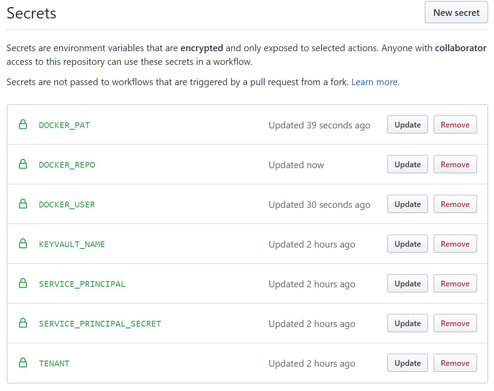
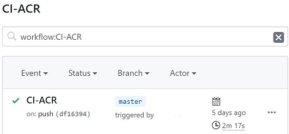

# Setup CI-CD with DockerHub

> Setup Github Actions to build and push the helium container to Docker Hub
>
> Note: These instructions should work with most Docker repositories but have only been tested with Docker Hub

## Enable GitHub Actions

By default, GitHub Actions are disabled for forked repositories. To enable:

- Go to your forked repository on github.com
- Click on the Actions tab
- Click on the enable button

## Create Service Principal for ACR

> Note: These instructions depend on the setup environment variables being set correctly

```bash

# source environment variables if needed
source ~/.azure/.helium.env

```

Create a Service Principal and grant permissions

> Note: We use a different Service Principal as this SP needs a higher access level

```bash

# create a Service Principal
export He_SP_PWD_CICD=$(az ad sp create-for-rbac -n http://${He_Name}-acr-sp-cicd --query password -o tsv)
export He_SP_ID_CICD=$(az ad sp show --id http://${He_Name}-acr-sp-cicd --query appId -o tsv)

# get the Container Registry Id
export He_ACR_Id=$(az acr show -n $He_Name -g $He_ACR_RG --query "id" -o tsv)

# assign acrpush access to Service Principal
az role assignment create --assignee $He_SP_ID_CICD --scope $He_ACR_Id --role acrpush

# Grant Key Vault access to Service Principal
export He_SP_OID_CICD=$(az ad sp show --id $He_SP_ID_CICD --query objectId -o tsv)
az keyvault set-policy -n $He_Name --secret-permissions get list --key-permissions get list --object-id $He_SP_OID_CICD

```

## Add Docker Credentials to Github Secrets

In the browser, navigate to your forked repo page in Github to set up credentials with the newly created service principal.

- Go to Settings -> Secrets
- Select "Add a new secret"
- Add the Service Principal:
  - Name: SERVICE_PRINCIPAL
  - Value: copy from `echo $He_SP_ID_CICD`
- Add the Service Principal Secret:
  - Name: SERVICE_PRINCIPAL_SECRET
  - Value: copy from `echo $He_SP_PWD_CICD`
- Add the Tenant ID:
  - Name: TENANT
  - Value: copy from `az account show --query tenantId -o tsv`
- Add the Docker Repository:
  - Name: DOCKER_REPO
  - Example Value: `retaildevcrew/helium-csharp`
- Add the Docker User:
  - Name: DOCKER_USER
  - Example Value: `your Docker User ID`
- Add the Docker Personal Access Token:
  - Name: DOCKER_PAT
  - Example Value: `your Docker PAT (or password)`
- Add Key Vault Name:
  - Name: KEYVAULT_NAME
  - Value: copy from `echo $He_Name`

### Secrets

After adding the secrets, your repo should look like this



## Run the Workflow

> The GitHub action only runs on PR to main or commit to main

- Merge a change into main
- Navigate to the Actions tab in your GitHub repo
- You should see results similar to below

### CI-CD Results


