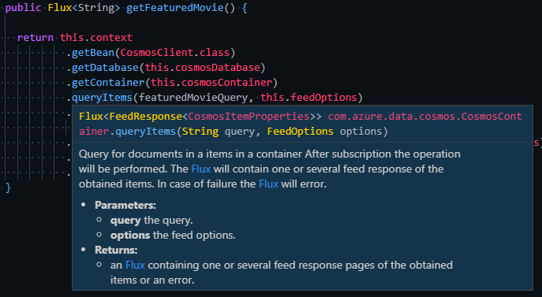

# Java Spring WebFlux Developer Documentation

## Index

1. [Frameworks and SDKs](#Frameworks-and-SDKs)
    - [Identity](#identity)
    - [Key Vault](#key-vault)
    - [Configuration Cache](#configuration-cache)
2. [Managed Identity and Key Vault](#managed-identity-and-key-vault)
3. [Cosmos DB](#cosmos-db)
    - [Partition Key Function](#partition-key-function)
4. [AKS Pod Identity Support](#aks-pod-identity-support)
    - Work in progress
5. [Versioning](#versioning)
6. [Middleware](#middleware)
    - [Request Logger](#request-logger)
7. [Logging](#logging)

## Frameworks and SDKs

For the Java version of this project we chose to use Spring WebFlux.  This gives us an asynchronous framework on which to build and aligns with the latest version of the CosmosDB SDK for Java which also uses WebFlux.  



`Figure 01: CosmosDB & WebFlux`

As illustrated above it provides a natural flow within the code sinze the frameworks match.  Additionally, we used beta framewoks to provide the best security options available on the platform presently.  Those are covered in the subsequent sections.  

> **Important**
> At the time of release the version of the CosmosDB SDK relied on a version of Netty that had a bug which would cause closed connections to be used from the connection pool.  We observed this was a factor after 10 - 12 hours of running.  There is an upcoming change that will incorporate the Netty remediation.  We will update the dependency and remove this note once available.

### Identity

The identity SDK is a core component of this project.  It is via the credentials created using the SDK that the application accesses Key Vault to resolve runtime configuration and secrets.

```xml

<dependency>
    <groupId>com.azure</groupId>
    <artifactId>azure-identity</artifactId>
    <version>1.1.0-beta.5</version>
</dependency>

```

As can be seen in the dependency configuration, this is one of the framewoks that we are using which is in a pre-release ([beta-5](https://azuresdkdocs.blob.core.windows.net/$web/java/azure-identity/1.1.0-beta.5/index.html)) state. This version of the Azure Identity SDK came with the ability for us to create discrete credentials so that we could target Managed Service Identity (MSI) and Azure CLI (CLI).  Additionally, this version would allow for the creation of other identity types such as `IntelliJCredential` and `VSCodeCredential` should you want to support them.

The identiy SDK is used only in the `KeyVaultService` `@Service` class as that is the only place the code actively authenticates presently.

[KeyVaultService.java](https://github.com/retaildevcrews/helium-java/blob/master/src/main/java/com/cse/helium/app/services/keyvault/KeyVaultService.java#L49)

```java

public KeyVaultService(IEnvironmentReader environmentReader)
    throws HeliumException {

    if (this.authType.equals(Constants.USE_MSI)) {

        credential = new ManagedIdentityCredentialBuilder().build();

    } else if (this.authType.equals(Constants.USE_CLI)) {

        credential = new AzureCliCredentialBuilder().build();

    } else if (this.authType.equals(Constants.USE_MSI_APPSVC)) {
        try {
        credential = new ManagedIdentityCredentialBuilder().build();
        } catch (final Exception ex) {
        logger.error(ex.getMessage());
        throw new HeliumException(ex.getMessage());
        }
    } else {
        this.authType = Constants.USE_MSI;
        credential = new ManagedIdentityCredentialBuilder().build();
    }

```

The above code has been abridged, but shows the creation of the credential type in the `KeyVaultService` constructor based on either a command line flag or an environment variable.

### Key Vault

The April 2020 version [4.1.2](https://azuresdkdocs.blob.core.windows.net/$web/java/azure-security-keyvault-keys/4.1.2/index.html) of the Azure Key Vault Java SDK is used.  Key Vault + Managed Service Identity are the core enabling technologies in the secure by design pattern that we are advocating.  The only setting that is passed to the application is the name of the Key Vault.  All other endpoints and access secrets are stored as secrets in Key Vault.

The `KeyVaultService` class contains all of the Key Vault access code.  It is marked with an `@Service` attribute so that it may be construced and injected by Spring.  During construction the class creates a credential as illustrated in the Identity section.  After that it creates clients for Secrets, Certificates, and Keys.

```java

secretAsyncClient = new SecretClientBuilder()
    .vaultUrl(getKeyVaultUri())
    .credential(credential)
    .addPolicy(getKvLogPolicy())
    .buildAsyncClient();

//build key client
keyAsyncClient = new KeyClientBuilder()
    .vaultUrl(getKeyVaultUri())
    .credential(credential)
    .buildAsyncClient();

//build certificate client
certificateAsyncClient = new CertificateClientBuilder()
    .vaultUrl(getKeyVaultUri())
    .credential(credential)
    .buildAsyncClient();

```

While Certificates and Keys are not used in this implementation the class was built with them completed so that its use could be expanded with little to no modification.

> **Important Note**
> This version of the KeyVault SDK will log return values in plain text if the log level is set to **BODY_AND_HEADERS**.  For that reason, a custom loggin policy is used. That implementation may be found in the `KeyVaultSecretsLogPolicy` class. That class is responsible for redacting any values that come through the log so that they will not show up in log files or in the terminal window.  Additionally, the mapping of general log setting to the custom policy setting is shown in the following table.
>
KV Log Level | Description | App Log Level | Reason
-- | -- | -- | --
BASIC | Logs only URLs, HTTP methods, and time to finish the request. | WARN, ERROR, FATAL | Matching decreased information
BODY | Logs everything in BASIC, plus all the request and response body. Note that only payloads in plain text or plain text encoded in GZIP will be logged. | N/A | Unused as it will show plain text secrets
BODY_AND_HEADERS | Logs everything in HEADERS and BODY. | TRACE, DEBUG | A custom log policy redacts plain text secrets.
HEADERS | Logs everything in BASIC, plus all the request and response headers. | INFO | Matching increased amount of information
NONE | Logging is turned off. | OFF | This level is not currently used

### Configuration Cache

A `ConfigurationService` class has been defined within the project.  This class uses the `KeyVaultService` to retrieve all of the values from Key Vault needed to access data.  This information is fetched and cached at start-up.  Additionally, the `ConfigurationService` is injected into the `CosmosDbConfig` so that location and credentials for the CosmosDB configuration may be accessed.

> **NOTE on Key Rotation**
> Key rotation will need to be implemented in this class to ensure that it repopulates the cache.  Additionally, it will need to trigger clearing any constructed versions of the Data Access Classes as they will need to use the update configuration values.

## Cosmos DB

### Partition Key Function

In order to directly read a document using 1 RU (assuming the document is 1K or less), you need the document's ID and partition key. A good CosmosDB best practice is to compute the partition key from the ID. In our case, we use the integer portion of the Movie or Actor document mod 10. This gives us 10 partitions ("0" - "9") with good distribution. For a deeper discussion on the document modeling decisions, please read this [document](https://github.com/retaildevcrews/imdb).

[CommonUtils.java](https://github.com/retaildevcrews/helium-java/blob/master/src/main/java/com/cse/helium/app/utils/CommonUtils.java#L28)

```java

/**
   * GetPartitionKey.
   */

  public String getPartitionKey(String id) {
    // validate id
    if (!StringUtils.isEmpty(id) && id.length() > 5 && StringUtils.startsWithIgnoreCase(id, "tt")
        || StringUtils.startsWithIgnoreCase(id, "nm")) {
      int idInt = Integer.parseInt(id.substring(2));
      return String.valueOf(idInt % 10);
    }
    throw new IllegalArgumentException("Invalid Partition Key");
  }

```

## AKS Pod Identity Support

- Work in progress

## Versioning

Helium dynamically builds a version string based on the package version and date time of build. This is displayed in the both the /version and healthz/ietf endpoint responses. The addition of date time to the version string in combination with the /version endpoint allows for quick verification that the latest build has been deployed with CI/CD.

[BuildConfig.java](https://github.com/retaildevcrews/helium-java/blob/master/src/main/java/com/cse/helium/app/config/BuildConfig.java)

```java

  /**
   * getBuildVersion. Returns build version.
   */
  public String getBuildVersion() {
    // An Instant represents a moment on the timeline in UTC with a resolution of up to nanoseconds.
    Instant buildTime = context.getBean(BuildProperties.class).getTime();

    // major.minor.MMd.hhmm
    String major = context.getBean(BuildProperties.class).getVersion();

    DateTimeFormatter formatter = DateTimeFormatter
        .ofPattern("MMdd.hhmm")
        .withZone(ZoneId.of("UTC"));

    String formattedDateTime = formatter.format(buildTime);

    return major + "+" + formattedDateTime;
  }

```

## Middleware

### Request Logger

A custom Request Logger extension is added to handle logging Http request information. As implemented, only 4xx and 5xx responses are logged. This helps make logs easy to search through when debugging errors, rather than having to navigate through several successful requests. Log level can be controlled with the --log-level command line parameter. The default is `warn`.

Code: [Request Logger](https://github.com/retaildevcrews/helium-java/blob/master/src/main/java/com/cse/helium/app/middleware/RequestLogger.java)

## Logging

Helium uses the Apache Log4j log service. Log4j supports 6 logging levels and Helium currently implements all of them. The stream logging level definition determines which logs are output to the stream. For instance, if the stream logging level is set to warn, only warn logs and higher (error and fatal) will be logged. The default stream logging level is warn, which can be changed via command line (--log-level argument).
